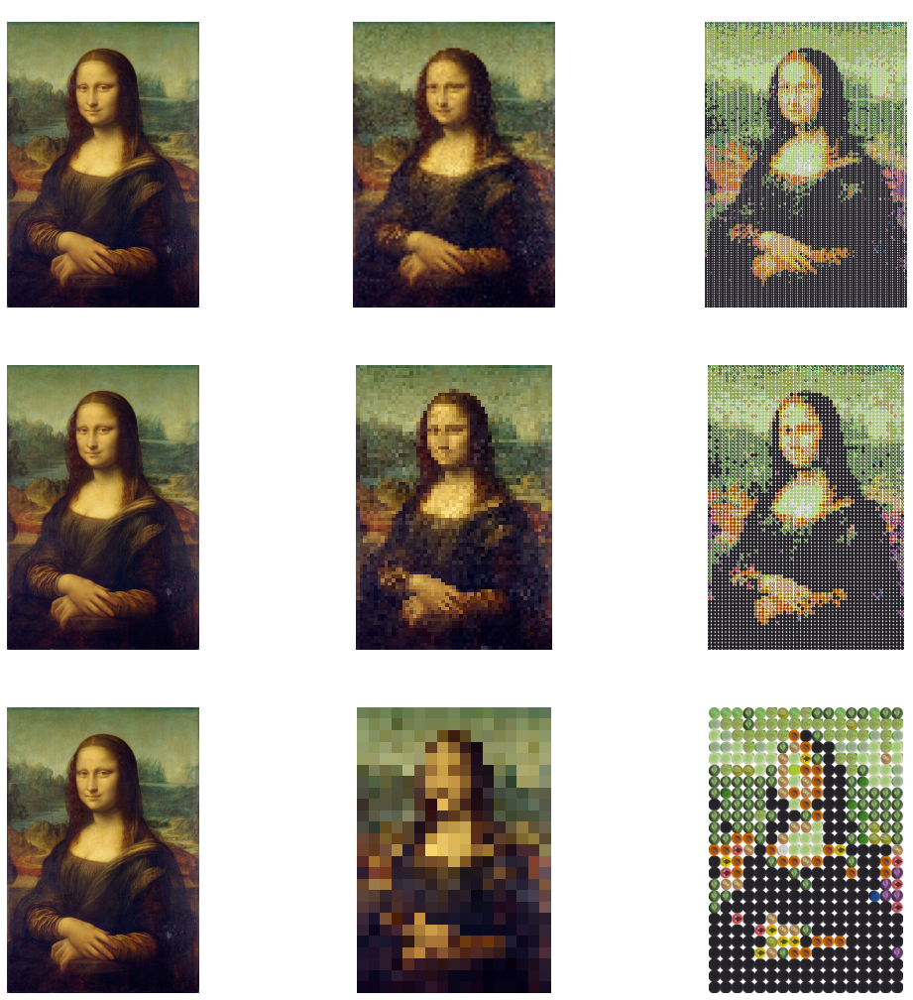

# Mosaico com Tampinhas de Garrafa PET

Projeto apresentado ao curso de Engenharia de Computação do Centro de Informática, da Universidade Federal da Paraíba, como requisito de avaliação na disciplina de Introdução ao Processamento Digital de Imagens 2023.2.

## Descrição

Este projeto tem como objetivo criar um mosaico utilizando tampinhas de garrafa PET. O mosaico é gerado a partir de uma imagem de entrada, onde cada pixel é substituído por uma tampinha de cor correspondente.

## Colaboradores

- [Carlos Eduardo Cavalcanti](https://github.com/carloseduardocsf)
- [Pedro Henrique Sotero](https://github.com/pedrosotero)
- [Taylor Cantalice](https://github.com/taylorkcantalice)

## Licença

Este projeto está licenciado sob a Licença MIT. Veja o arquivo [LICENSE](LICENSE) para mais detalhes.